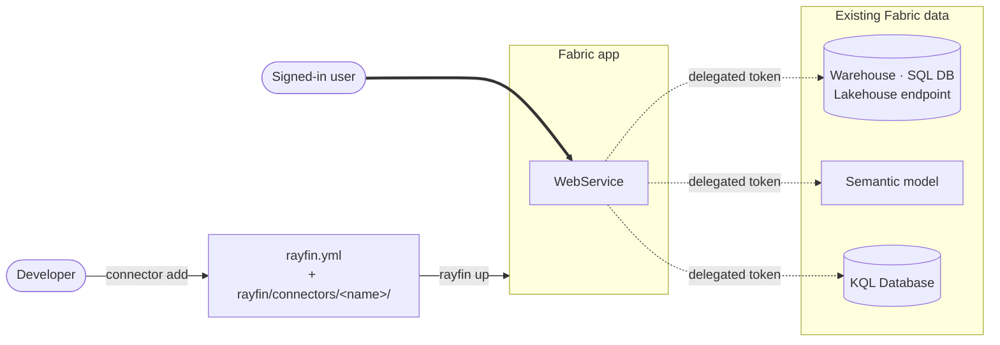

Connectors let a Rayfin app query data it does not own. Your [entities](/docs/data) live in
the database Rayfin provisions for you; a connector points at data that already exists
somewhere else in Microsoft Fabric — a Warehouse, a SQL Database, a Lakehouse SQL analytics
endpoint, a Power BI semantic model, or a KQL database — and exposes it through the same
client.

> [!WARNING]
> Connectors are in private preview. The `rayfin connector` command group is hidden until
> you opt in, `ConnectorsRayfinClient` ships from an `/experimental` subpath, and the API may
> change between releases. Confirm the feature is available in your own tenant before you
> design an app around it.

## The two categories

Which commands apply, and what your app code looks like, depends on the connector's
category.

| | Category A — entity connectors | Category B — query connectors |
| --- | --- | --- |
| **Types** | `fabric-sqlanalytics`, `fabric-warehouse`, `fabric-sqldatabase` | `fabric-semanticmodel`, `kusto` |
| **App surface** | `client.connectors.<name>.<Entity>` — typed CRUD | `client.connectors.<name>.executeQuery(...)` |
| **You write** | Entity classes with `@role()` policies | A DAX or KQL query string |
| **Row-level security** | Yes, via `@role()` policies | No — the source enforces its own |
| **Schema discovery** | Yes — `metadata.json` | No |
| **Auth** | `delegated` or `application` | `delegated` only |

Category A turns Fabric SQL into typed entities that behave like your own — see
[Fabric SQL sources](/docs/connectors/sql-sources). Category B hands a raw query to a
platform-managed function and returns a table — see [Semantic models](/docs/connectors/semantic-models)
and [KQL databases](/docs/connectors/kusto).

## Connector types

| Type | Fabric item | Category | Operations | Auth |
| --- | --- | --- | --- | --- |
| `fabric-sqlanalytics` | Lakehouse | A | `read` | `delegated`, `application` |
| `fabric-warehouse` | Warehouse | A | `read`, `create`, `update`, `delete` | `delegated`, `application` |
| `fabric-sqldatabase` | SQL Database | A | `read`, `create`, `update`, `delete` | `delegated`, `application` |
| `fabric-semanticmodel` | Semantic model | B | `executeQuery` | `delegated` |
| `kusto` | KQL Database | B | `executeQuery`, `executeCommand` | `delegated` |

Lakehouse SQL analytics endpoints are read-only at the source, so `fabric-sqlanalytics`
allows only `read`. Category B types are pinned to an adapter version (`version: '1'` today)
and are delegated-only — `rayfin up` rejects `auth.type: application` on them. See
[Connector authentication](/docs/connectors/auth).

Run `npx rayfin connector types --json` to print the live catalog, including the exact client
packages and version to install for each type.

## Enable connectors

The `connector` command group is registered only when the project opts in. Prefer the
declarative setting:

```yaml title="rayfin/rayfin.yml"
services:
  connectors:
    enabled: true
```

Two other things also turn it on: a non-empty `connectors:` block in `rayfin.yml` (which
`connector add` writes, so the feature is self-sustaining after the first connector), and the
environment variable for a single command:

```bash
RAYFIN_FEATURE_FLAGS=connectors npx rayfin connector types
```

With none of the three, the CLI reports an unknown command.

## How a connector reaches your app



Nothing about the source reaches the browser. The workspace and item IDs live in
`rayfin.yml` and are injected server-side, so a client-side query carries only the query
itself.

## Where connector state lives

| Path | Written by | Contents |
| --- | --- | --- |
| `rayfin/rayfin.yml` | `connector add` | The `connectors:` block — `name`, `type`, `version`, `config`, `auth`, `operations` |
| `rayfin/connectors/<name>/metadata.json` | `connector add` | Discovered schema. Category A only. Never edit by hand |
| `rayfin/connectors/<name>/schema.ts` | `connector add`, then you | The typed marker and `connectorConfig` your app imports |

`connector add` scaffolds a **placeholder** `schema.ts` for Category A. You replace it with
the aggregate schema after generating entity files — see
[Generating entity files](/docs/connectors/entity-generation). For Category B the generated
`schema.ts` is complete and must not be edited.

## The workflow

### 1. Find the source

`npx rayfin connector search` lists the Fabric items the signed-in identity can add, with a
ready-to-run `add` command for each.

### 2. Add it

`npx rayfin connector add --type <type> --workspace-id <id> --item-id <id>` writes the
`rayfin.yml` entry and scaffolds the connector directory. See
[Adding a connector](/docs/connectors/adding).

### 3. Install the packages

`connector add` scaffolds files but installs nothing. Run the version-pinned `npm install`
it prints, verbatim.

### 4. Build the typed surface

Category A: generate entity files from `metadata.json` and write the aggregate `schema.ts`.
Category B: the generated `schema.ts` is already complete.

### 5. Wire the client

Expose the connector as `client.connectors.<name>` through `ConnectorsRayfinClient` — see
[Wiring connectors into your app](/docs/connectors/client-setup).

### 6. Deploy

`npx rayfin up` deploys the connector alongside the rest of the app.

## In this section

- **[Adding a connector](/docs/connectors/adding)** — `search`, `add`, `list`, `remove`, and
  the `rayfin.yml` entry they produce.
- **[Wiring connectors into your app](/docs/connectors/client-setup)** —
  `ConnectorsRayfinClient`, the runtime map, and the bundling trap to avoid.
- **[Fabric SQL sources](/docs/connectors/sql-sources)** — reading and writing Category A
  entities, and what each dialect returns.
- **[Generating entity files](/docs/connectors/entity-generation)** — turning
  `metadata.json` into entity classes with row-level policies.
- **[Semantic models](/docs/connectors/semantic-models)** — running DAX and reading the
  result.
- **[KQL databases](/docs/connectors/kusto)** — running KQL queries and management commands.
- **[Connector authentication](/docs/connectors/auth)** — `delegated` versus `application`,
  and the permissions each needs.

```prompt title="Connect a Rayfin app to existing Fabric data"
In my Rayfin project, connect to an existing Microsoft Fabric data source (ask me which one —
a Warehouse, SQL Database, Lakehouse SQL analytics endpoint, semantic model, or KQL database,
and ask me for its workspace ID and item ID rather than inventing them).

First enable the feature by adding services.connectors.enabled: true to rayfin/rayfin.yml.
Then run `npx rayfin connector add --type <type> --workspace-id <id> --item-id <id>` and run
the version-pinned npm install command it prints, verbatim — do not drop the version.

If it is a Category A type (fabric-sqlanalytics, fabric-warehouse, fabric-sqldatabase),
generate entity files from rayfin/connectors/<name>/metadata.json and overwrite the
placeholder schema.ts with the aggregate schema. If it is Category B (fabric-semanticmodel,
kusto), the generated schema.ts is already complete — do not edit it.

Finally, wire it up as client.connectors.<name> with ConnectorsRayfinClient imported from
@microsoft/rayfin-client/experimental, and deploy with `npx rayfin up`.
```
