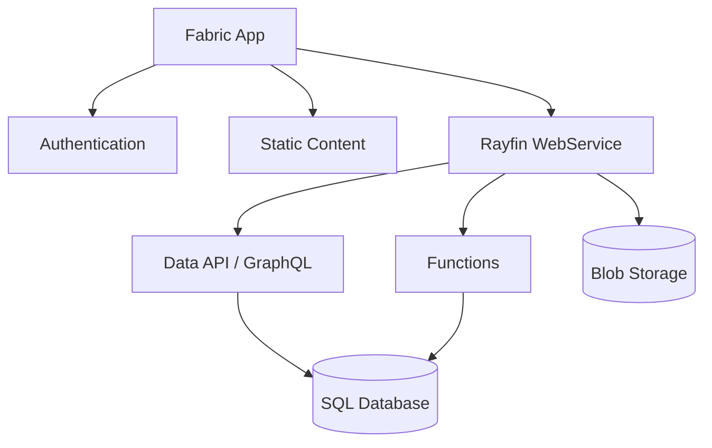

A **Fabric app** is a Fabric item that hosts your Rayfin project as a managed service.
Fabric provisions and operates the database, authentication, static hosting, and API
endpoints, so you maintain application code instead of infrastructure.

## What a Fabric app contains

Every Fabric app exposes a single Rayfin endpoint backed by a set of child services:



Data, authentication, and static hosting are the core services. [Functions](/docs/functions)
and [blob storage](/docs/storage) are optional — enable them in `rayfin.yml` when you need
them.

A Fabric app lives inside a Fabric workspace. A workspace can hold multiple Fabric apps —
for example, one per environment or one per project.

## Prerequisites

### Fabric capacity

The workspace that will hold your Fabric app must have Fabric capacity assigned — select a
capacity when you create the workspace if it does not already have one. Every service your
app uses consumes capacity units from that assignment. See
[Capacity and billing](/docs/deploy/pricing) for what consumes capacity and what does not.

### Tenant admin setting

A Fabric tenant administrator must enable the Fabric app workload before anyone in the
tenant can create one:

1. Sign in to the [Fabric admin portal](https://app.fabric.microsoft.com/admin-portal).
2. Go to **Tenant settings**.
3. Under **Fabric Apps (preview)**, toggle the setting to **Enabled**.
4. Choose whether to enable it for the whole organization or specific security groups.
5. Click **Apply**.

Changes can take a few minutes to propagate. If you are not a tenant admin, ask your
Fabric administrator to complete this step before trying to create a Fabric app.

## Create a Fabric app in the portal

1. Open [Microsoft Fabric](https://app.fabric.microsoft.com) and sign in with your
   Microsoft account.
2. Select a workspace from the left navigation, or create one: **Workspaces** → **New
   workspace** → enter a name and select a Fabric capacity.
3. In the workspace, click **New item**, then search for and select **App (preview)** —
   this is the item type a Rayfin project deploys into.
4. Enter a name (for example, `my-rayfin-app`) and click **Create**.
5. Click **Open in VS Code** on the new item to load the project, then use GitHub Copilot
   to build your app.
6. When you are ready to ship, run `npx rayfin up` from the project's terminal. See
   [Deploying with rayfin up](/docs/deploy/rayfin-up) for the full workflow.

```prompt title="Create and deploy a Fabric app"
I have a Rayfin project ready to ship. Sign me in with `npx rayfin login`, then run `npx
rayfin up` to create a Fabric app for it (or update the existing one, if
rayfin/.deployments.json already has a deployment) and deploy the current build. Once it
finishes, run `npx rayfin up status` and tell me the live hosting URL.
```

## Child services

`rayfin up` provisions these as child items under the Fabric app, based on your
`rayfin.yml`:

| Child service | What it provides | Portal capabilities |
| --- | --- | --- |
| **SQL Database** | An MSSQL database with the schema generated from your TypeScript data model decorators. | View the database and run queries with the query editor, or copy the connection string. Read-only — schema changes must come from your code via `rayfin up`. |
| **Authentication** | Fabric brokered auth using Microsoft Entra ID (SSO). Users sign in with their existing Fabric identity. | View authenticated users in the SQL Database. |
| **Static Content** | Your built frontend assets (HTML, CSS, JS), served at a public URL from OneLake storage. | View the hosting URL. Assets update on every deploy. |

## The Rayfin endpoint

Every Fabric app has one Rayfin endpoint that fronts all of its services:

```text
https://<your-app>-app.rayfin.windows.net/
```

| Path | Service |
| --- | --- |
| `/api/graphql` | Data API (GraphQL) — used by `RayfinClient` for CRUD operations. |
| `/auth` | Authentication service. |
| `/storage` | File storage. |

Your frontend reads this endpoint from the `RAYFIN_PUBLIC_API_URL` variable in
`rayfin/.env`. See [Environments and configuration](/docs/deploy/environments) for how
that value is generated into `.env.local` for your framework.

## Manage it in the Fabric portal

Open the Fabric app in the portal to see its **Rayfin endpoint**, its **App URL** (the
public static content URL), and a link back to the Fabric portal. Click into it to see
child items: the **SQL Database** (opens the query editor for read-only queries) and
**Authentication** (view signed-in users). Schema changes made directly in the portal's
query editor are overwritten on the next `rayfin up`.

### Permissions

Workspace roles do not automatically carry item-level permissions. To let someone in your
organization open and use the app, grant them **Run and interact** on the Fabric app item.

| Permission | What it allows |
| --- | --- |
| **Run and interact** (default) | Open and use the deployed app. Every workspace member gets this by default. |
| **Edit (Write)** | Deploy code with `rayfin up`, apply schema changes, update settings, and manage child services. Requires **contributor** or **admin** on the workspace. |
| **Reshare** | Grant other users access to the Fabric app. Requires **admin** on the workspace. |

See [Workspace roles](https://learn.microsoft.com/fabric/fundamentals/roles-workspaces) in
the Microsoft Fabric documentation for how workspace roles work.

## Next steps

- [Deploying with rayfin up](/docs/deploy/rayfin-up) — the full deploy workflow and CLI
  flags.
- [Capacity and billing](/docs/deploy/pricing) — what running this app costs in Fabric
  capacity units.
