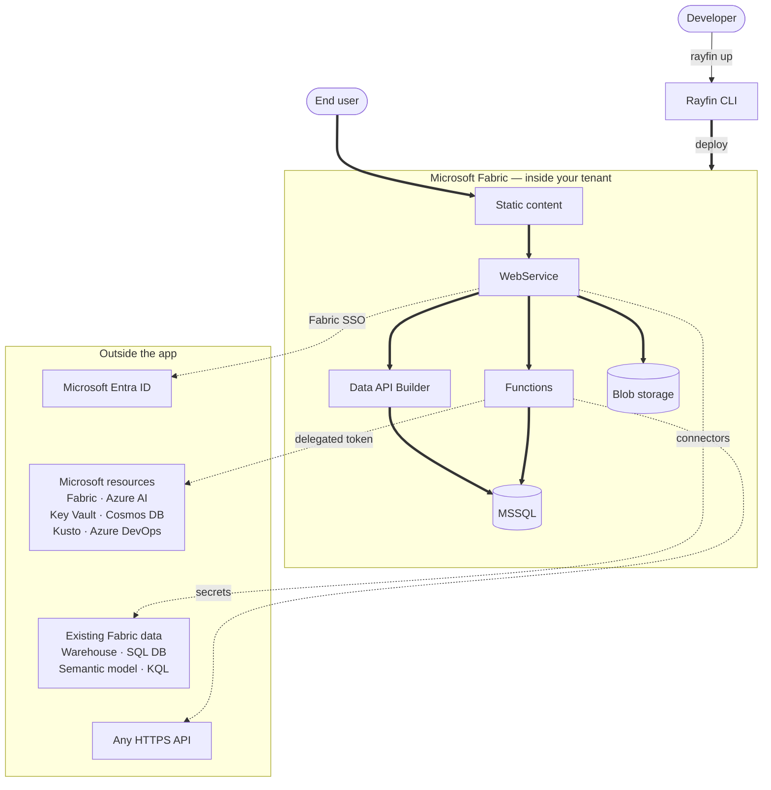

Rayfin is a backend platform for TypeScript developers. You define your data model as
decorated TypeScript classes, and Rayfin generates the database schema, REST and GraphQL
APIs, and type-safe clients — then runs them on Microsoft Fabric with authentication,
functions, blob storage, and static hosting built in.

```typescript title="rayfin/data/Todo.ts"
import { entity, uuid, text, boolean, authenticated } from '@microsoft/rayfin-core';

@entity()
@authenticated('*', { policy: (claims, item) => claims.sub.eq(item.user_id) })
export class Todo {
  @uuid() id!: string;
  @text({ max: 200 }) title!: string;
  @boolean({ default: false }) isCompleted!: boolean;
  @text({ max: 128 }) user_id!: string;
}
```

That class becomes a table, a GraphQL API, a typed client, and a row-level security
policy. One command deploys all of it.

```bash
npx rayfin up
```

> [!NOTE]
> Rayfin supports TypeScript as the only language for data models, client code, and
> application logic.

## Get started

If you read one page, read the [Quickstart](/docs/start/quickstart) — it goes from an empty
terminal to a running app in four commands.

- **[Installation](/docs/start/installation)** — install Node.js 20+ and the GitHub CLI on
  Windows, macOS, or Linux.
- **[Quickstart](/docs/start/quickstart)** — scaffold a project, deploy its backend to
  Fabric, and run the frontend locally against it.
- **[Project structure](/docs/start/project-structure)** — the `rayfin/` folder,
  `rayfin.yml`, and how entity classes become a database schema.
- **[Deploy to Fabric](/docs/start/deploy-to-fabric)** — enable the tenant setting, create
  a Fabric app, and deploy with `rayfin login` and `rayfin up`.

## How a Fabric app runs

Rayfin runs one way: as a managed **Fabric app** on Microsoft Fabric.



`rayfin up` packages your project and provisions it as a Fabric app: Fabric hosts the
MSSQL database, a WebService and Data API Builder layer in front of it, your built frontend
as static content, and sign-in through Fabric SSO (Entra ID) — the only auth provider
available once the app is deployed.

[Functions](/docs/functions) and [blob storage](/docs/storage) are optional services you
enable in `rayfin.yml`. Functions are also how the app reaches anything outside itself. They
call any HTTPS API using secrets from `rayfin secret set`, and they reach Microsoft
resources — Fabric, Azure AI, Key Vault, Cosmos DB, Event Grid, Kusto, Azure DevOps —
through [delegated authentication](/docs/functions/connections): the runtime exchanges the
caller's identity for a resource-scoped token, so the function acts **as the signed-in
user** rather than as a shared service identity.

[Connectors](/docs/connectors) cover the other direction: data that already lives in Fabric.
Point one at a Warehouse, SQL Database, Lakehouse SQL endpoint, semantic model, or KQL
database and query it from the same client — as typed entities, or with DAX and KQL. Those
queries also run under the signed-in user's identity. See
[Delegated access](/docs/auth/delegated-access) for how the surfaces relate.

> [!WARNING]
> Functions, blob storage, connectors, and delegated authentication are experimental or in
> preview, and are not available in every Fabric region or tenant. Confirm availability in
> your tenant before you depend on them.

During development, a local Vite server takes the place of the *Static content* node above:
`npx rayfin up --exclude-services staticHosting` deploys everything else to Fabric, and
`npm run dev` serves the frontend from `localhost` against that deployed backend. There is
no backend to run yourself.

## Build your app

- **[Data](/docs/data)** — model entities, query them, and control who can read each row.
- **[Auth](/docs/auth)** — sign users in with Fabric SSO and read claims on the server.
- **[Functions](/docs/functions)** — server-side TypeScript for logic that does not belong
  in the client. Experimental.
- **[Connectors](/docs/connectors)** — read and write data that already exists in Fabric:
  warehouses, SQL databases, semantic models, and KQL databases. Preview.
- **[Storage](/docs/storage)** — upload, serve, and secure files in blob storage.
  Experimental.
- **[Hosting](/docs/hosting)** — build and serve your frontend from the deployed app.
- **[Deploy](/docs/deploy)** — secrets, environments, capacity, and troubleshooting.

## Using an agent

These docs are built for coding agents as much as for people. Every page has a raw
Markdown mirror — append `.md` to any URL — and the whole corpus is available at
[`/llms-full.txt`](/llms-full.txt).

```prompt title="Point your agent at Rayfin"
Read https://rayfin.ai/llms.txt and then https://rayfin.ai/docs/reference/agent-rules.md so you know how
to work with the Rayfin SDK and CLI. Every page on that site is available as raw Markdown by
appending .md to its URL. Then help me build a Rayfin app.
```

See [Rules for coding agents](/docs/reference/agent-rules) for the constraints an agent
needs before it writes Rayfin code.

## Reference

- [CLI](/docs/reference/cli) — every command and flag.
- [`rayfin.yml`](/docs/reference/config/rayfin-yml) — the configuration schema.
- [SDK](/docs/reference/sdk) — API reference for every `@microsoft/rayfin-*` package.
- [Known limitations](/docs/reference/known-limitations) — current constraints and workarounds.
