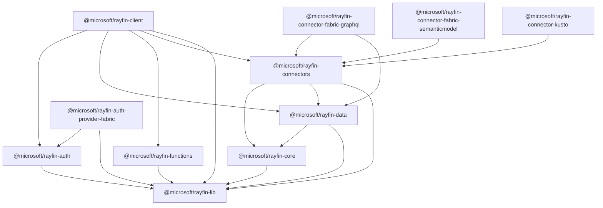

The Rayfin SDK is split into small, single-purpose packages rather than one monolithic
library. Most applications only install one or two of them directly — the rest arrive as
transitive dependencies.

## Which package do I need?

| I want to... | Package |
| --- | --- |
| Define entities, fields, relationships, and permissions in TypeScript | [`@microsoft/rayfin-core`](/docs/reference/sdk/rayfin-core) |
| Query and mutate data with a type-safe GraphQL client | [`@microsoft/rayfin-data`](/docs/reference/sdk/rayfin-data) — usually via `client.data`, rarely installed on its own |
| Sign users out and manage sessions | [`@microsoft/rayfin-auth`](/docs/reference/sdk/rayfin-auth) — usually via `client.auth` |
| Add Microsoft Fabric SSO | [`@microsoft/rayfin-auth-provider-fabric`](/docs/reference/sdk/rayfin-auth-provider-fabric) |
| One configured client for data, auth, and functions | [`@microsoft/rayfin-client`](/docs/reference/sdk/rayfin-client) — `RayfinClient` / `RayfinServerClient` |
| Call serverless functions from the client | [`@microsoft/rayfin-functions`](/docs/reference/sdk/rayfin-functions) — experimental |
| Store and serve files | [`@microsoft/rayfin-storage`](/docs/reference/sdk/rayfin-storage) |
| Query an existing Fabric warehouse, SQL database, semantic model, or KQL database | [`@microsoft/rayfin-connectors`](/docs/reference/sdk/rayfin-connectors) — experimental runtime kernel |
| Type a Fabric warehouse, SQL database, or Lakehouse SQL analytics endpoint connector | [`@microsoft/rayfin-connector-fabric-graphql`](/docs/reference/sdk/rayfin-connector-fabric-graphql) — type-only Category A marker |
| Type and run a Fabric semantic model connector | [`@microsoft/rayfin-connector-fabric-semanticmodel`](/docs/reference/sdk/rayfin-connector-fabric-semanticmodel) — DAX marker and runtime |
| Type and run a Fabric KQL Database connector | [`@microsoft/rayfin-connector-kusto`](/docs/reference/sdk/rayfin-connector-kusto) — KQL marker and runtime |
| *(internal)* shared HTTP client, error types, naming utilities | [`@microsoft/rayfin-lib`](/docs/reference/sdk/rayfin-lib) |

In practice, most applications install two packages:

```bash
npm install @microsoft/rayfin-core @microsoft/rayfin-client
```

Add `@microsoft/rayfin-auth-provider-fabric` when deploying to Fabric with Fabric SSO, and
`@microsoft/rayfin-storage` or `@microsoft/rayfin-functions` when you use those services.
`@microsoft/rayfin-data`, `@microsoft/rayfin-auth`, and `@microsoft/rayfin-lib` are pulled
in automatically as dependencies of `@microsoft/rayfin-client` — install them directly only
if you need their lower-level API without the rest of the client.

## How the packages compose



`@microsoft/rayfin-core` is the odd one out in this graph: every other package is a
*runtime* client that talks to your deployed backend, while `rayfin-core` is what you
import in `rayfin/data/*.ts` to describe your schema at build/deploy time. `rayfin-data`
depends on it only for the shared `PrimaryKeyField` type, not for any runtime behavior.

## Version notes

- `rayfin-core`, `rayfin-client`, `rayfin-data`, `rayfin-auth`, `rayfin-auth-provider-fabric`,
  `rayfin-lib`, and `rayfin-functions` are versioned in lockstep — in the environment this
  reference was checked against, all seven were at the same `1.31.0` release. Keep them on
  matching versions in your own project; mixing versions across this family is untested.
- The CLI and tooling packages version independently from the SDK — `@microsoft/rayfin-cli`
  and `@microsoft/rayfin-docs` were at different version numbers than the SDK family in that
  same environment. Don't assume a CLI version implies a matching SDK version, or vice
  versa.
- `@microsoft/rayfin-functions` and `@microsoft/rayfin-storage` are the two packages still
  actively evolving — the functions package is explicitly marked experimental, and both are
  gated behind CLI feature flags in current builds. Expect their APIs to change faster than
  `rayfin-core`, `rayfin-client`, `rayfin-data`, and `rayfin-auth`.
- The connector packages ship in lockstep with the CLI, are preview APIs, and need
  version-pinned installs. Their npm `latest` and `preview` tags can lag the published
  release, so install the exact version printed by the connector tooling.
- When in doubt about the exact signature for the version you have installed, use
  `rayfin docs get --symbol <name>` or the [MCP server](/docs/reference/cli/docs#mcp-server) rather than
  trusting a cached mental model of the API — see
  [Rules for coding agents](/docs/reference/agent-rules).

## In this section

- [`@microsoft/rayfin-core`](/docs/reference/sdk/rayfin-core) — decorators for entities, fields, relationships, and permissions.
- [`@microsoft/rayfin-client`](/docs/reference/sdk/rayfin-client) — `RayfinClient` / `RayfinServerClient` construction and configuration.
- [`@microsoft/rayfin-data`](/docs/reference/sdk/rayfin-data) — the fluent query and mutation API behind `client.data`.
- [`@microsoft/rayfin-auth`](/docs/reference/sdk/rayfin-auth) — the auth client behind `client.auth`.
- [`@microsoft/rayfin-auth-provider-fabric`](/docs/reference/sdk/rayfin-auth-provider-fabric) — Fabric brokered SSO.
- [`@microsoft/rayfin-functions`](/docs/reference/sdk/rayfin-functions) — typed serverless function calls.
- [`@microsoft/rayfin-storage`](/docs/reference/sdk/rayfin-storage) — blob storage client.
- [`@microsoft/rayfin-connectors`](/docs/reference/sdk/rayfin-connectors) — connector runtime kernel and `ConnectorsRayfinClient` support.
- [`@microsoft/rayfin-connector-fabric-graphql`](/docs/reference/sdk/rayfin-connector-fabric-graphql) — type-only marker for Fabric SQL-backed entity connectors.
- [`@microsoft/rayfin-connector-fabric-semanticmodel`](/docs/reference/sdk/rayfin-connector-fabric-semanticmodel) — semantic model marker, runtime, and result helpers.
- [`@microsoft/rayfin-connector-kusto`](/docs/reference/sdk/rayfin-connector-kusto) — KQL Database marker, runtime, and result helpers.
- [`@microsoft/rayfin-lib`](/docs/reference/sdk/rayfin-lib) — shared HTTP client and utilities.
