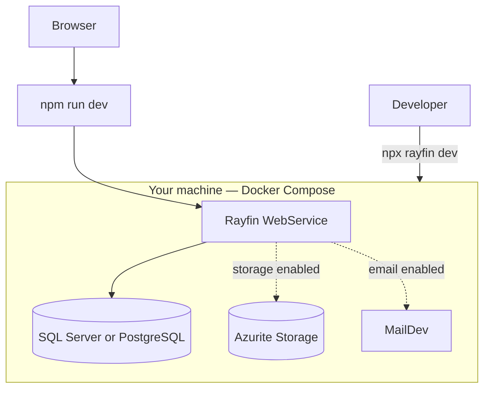
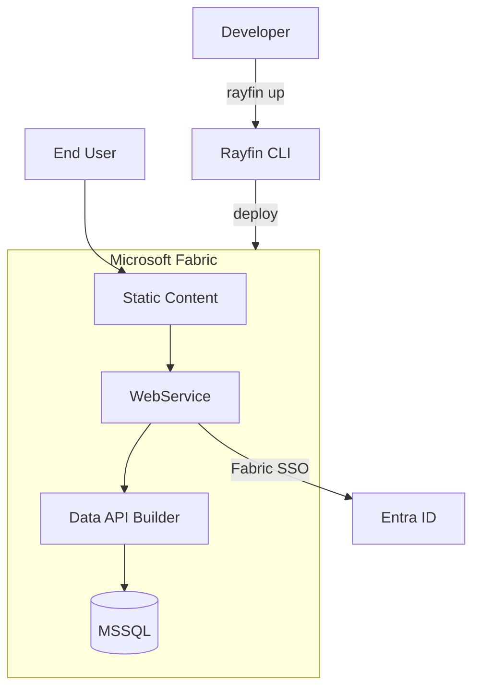

Rayfin is one SDK, one CLI, and one data-modeling workflow that runs in two places. This
page is the conceptual map: what each mode is, how it is put together, and exactly what
changes when you move from one to the other.

## Comparison

| | **Rayfin Local** | **Fabric app** |
| --- | --- | --- |
| What it is | Open-source, self-hostable backend stack | Managed service for Rayfin on Microsoft Fabric |
| Authentication | Entra ID, email and password | Fabric SSO (Entra ID single sign-on) only |
| Database | MSSQL, PostgreSQL | MSSQL only |
| Data models & APIs | ✅ | ✅ |
| Type-safe clients | ✅ | ✅ |
| Static hosting | ✅ | ✅ |
| CLI tooling | ✅ | ✅ |
| Infrastructure | You host it — Docker, VMs, or any cloud | Fabric manages hosting, scaling, and networking |

Start locally, then deploy to Fabric when you want a managed service — or stay self-hosted
indefinitely. Both paths use the same entity decorators, the same generated GraphQL API,
and the same `client.data.<Entity>` client code.

## Architecture

### Rayfin Local

A fully local Docker stack is available through `rayfin dev`: the Rayfin WebService
container, a database container for the dialect you chose (SQL Server or PostgreSQL), and
optional containers for storage (Azurite) and email (MailDev) when those services are
enabled in `rayfin.yml`. `rayfin dev` is a preview capability gated behind the
`docker-local-dev` feature flag (`RAYFIN_FEATURE_FLAGS=docker-local-dev`) and is not part
of the default workflow — see [Local development](/docs/start/local-development) for the
default, Fabric-backed local dev loop as well as this preview stack. Your frontend runs
outside Docker either way, as a normal Vite (or other) dev server.

See [Local development](/docs/start/local-development) for how to start, inspect, and
reset this stack.

### Fabric app

`npx rayfin up` packages your project and provisions it as a Fabric data app instead.
Fabric manages hosting, networking, and scaling — there are no containers for you to run.

See [Deploy to Fabric](/docs/start/deploy-to-fabric) for the full deployment workflow.

## What differs

### Authentication

Rayfin Local supports Entra ID and email/password sign-in, configured under
`services.auth` in `rayfin.yml` (`services.auth.fabric.enabled` and
`services.auth.password.enabled`). A deployed Fabric app supports **Fabric SSO (Entra ID
single sign-on) only** — email and password authentication works during local development
but does not work after deploying to Fabric. Design your sign-in UI around whichever mode
you are targeting; see [Auth](/docs/auth) for both flows.

### Database

Rayfin Local can use either MSSQL or PostgreSQL, set with `services.data.dialect` in
`rayfin.yml`. Fabric apps support **MSSQL only** — Fabric provisions a managed SQL
database for you. `dialect` is required whenever `services.data.enabled` is `true`;
omitting it fails with `Dialect is required when Data module is enabled` at deploy time,
locally or on Fabric.

### Everything else is shared

Entity decorators, the generated GraphQL schema, permission policies, the type-safe
`client.data.<Entity>` client, and static hosting configuration are identical in both
modes. Moving a project from Rayfin Local to a Fabric app is primarily a `rayfin.yml`
change — for example `dialect: mssql` and `services.auth.fabric.enabled: true` — rather
than a rewrite of application code.

## Choosing a mode

- **Start with Rayfin Local** while you are prototyping, do not yet have Fabric tenant
  access, want PostgreSQL, or want full control over infrastructure.
- **Move to a Fabric app** when you want Microsoft to manage hosting and scaling, need
  sign-in through your organization's existing Entra ID via Fabric SSO, or want to share
  the app inside a Fabric workspace.

## Next

- [Installation](/docs/start/installation) — install the prerequisites for either mode.
- [Quickstart](/docs/start/quickstart) — get a project running locally.
- [Deploy to Fabric](/docs/start/deploy-to-fabric) — take a local project to a managed app.
