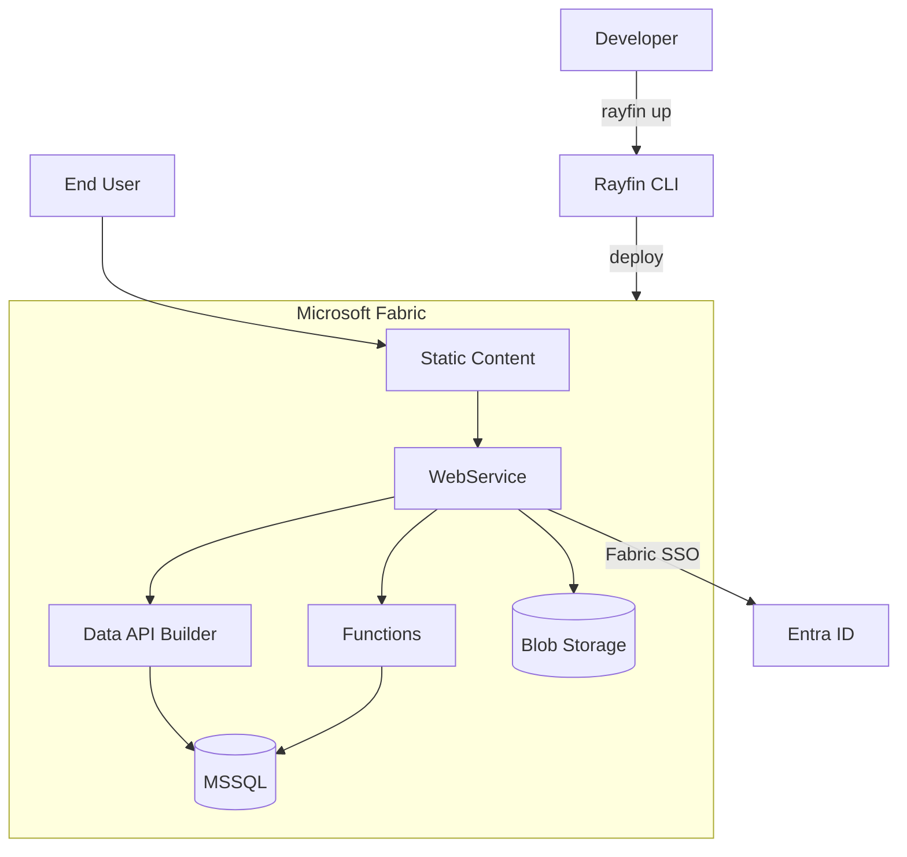

Rayfin runs one way: as a managed **Fabric app** on Microsoft Fabric. Fabric hosts the
database, the API, authentication, and your built frontend. The path is the same for every
project — install the prerequisites, scaffold with the CLI, deploy the backend to Fabric,
and run your frontend locally against that deployed backend.

If you read only one page in this section, read the [Quickstart](/docs/start/quickstart) —
it goes from an empty terminal to a running app in four commands.

## Set up your machine

- **[Installation](/docs/start/installation)** — install Node.js 20+ and the GitHub CLI on
  Windows, macOS, or Linux.
- **[Quickstart](/docs/start/quickstart)** — scaffold a project with
  `npm create @microsoft/rayfin@latest`, deploy its backend to Fabric, and run the frontend
  locally against it.

## Build your project

- **[Project structure](/docs/start/project-structure)** — the `rayfin/` folder,
  `rayfin.yml`, and how entity classes become a database schema.
- **[Deploy to Fabric](/docs/start/deploy-to-fabric)** — enable the tenant setting, create
  a Fabric data app, and deploy with `rayfin login` and `rayfin up`.

## How a Fabric app runs

`rayfin up` packages your project and provisions it as a Fabric data app: Fabric hosts the
MSSQL database, a WebService and Data API Builder layer in front of it, your built frontend
as static content, and sign-in through Fabric SSO (Entra ID) — the only auth provider
available once the app is deployed. [Functions](/docs/functions) and
[blob storage](/docs/storage) are optional services you enable in `rayfin.yml`.

During development, a local Vite server takes the place of the *Static Content* node above:
`npx rayfin up --exclude-services staticHosting` deploys everything else to Fabric, and
`npm run dev` serves the frontend from `localhost` against that deployed backend. See the
[Quickstart](/docs/start/quickstart) for the full loop.

## Next

Once your app is running, model your data in [Data](/docs/data), sign users in with
[Auth](/docs/auth), and — if a coding agent is doing the work — read
[Build with AI](/docs/ai) for the raw-Markdown mirrors, prompt library, and MCP server this
site exposes.
