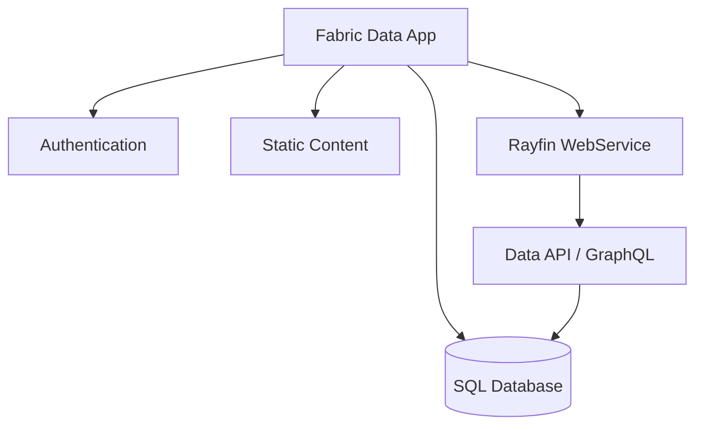

A **Fabric data app** is a Fabric item that hosts your Rayfin application as a managed service.
When you create a Fabric data app in a Fabric workspace, Fabric provisions and manages the backend infrastructure — database, authentication, static hosting, and API endpoints — so you can focus on your application code.

## What is a Fabric data app?

A Fabric data app is the Fabric representation of your Rayfin project.
It contains all the services your application needs, exposed through a single Rayfin endpoint.



Each Fabric data app lives inside a Fabric workspace.
You can create multiple Fabric data apps in the same workspace for different applications or environments.

## Prerequisites

### Fabric capacity

Your workspace must have Fabric capacity assigned. When creating a new workspace, select a Fabric capacity to associate with it. Rayfin services consume capacity units from the assigned capacity.

### Tenant admin settings

A Fabric tenant administrator must enable the Fabric data app workload before users can create items.

1. Sign in to the [Fabric admin portal](https://app.fabric.microsoft.com/admin-portal).
2. Navigate to **Tenant settings**.
3. Under **Fabric Apps (preview)**, toggle the setting to **Enabled**.
4. Choose whether to enable for the entire organization or specific security groups.
5. Click **Apply**.

Changes may take a few minutes to propagate.

## Child services

When you deploy your application with `rayfin up`, Fabric provisions child services based on your `rayfin.yml` configuration.
These child services appear as child items under the Fabric data app in the Fabric portal.

| Child service | What it provides | Portal capabilities |
| --- | --- | --- |
| **SQL Database** | MSSQL database with your schema applied from TypeScript data model decorators. | View database, run queries with the query editor, copy connection string. The database is read-only in the portal — schema changes must come from your code via `rayfin up`. |
| **Authentication** | Fabric brokered auth using Microsoft Entra ID (SSO). Users sign in through their existing Fabric identity. | View authenticated users inthe SQL Database. |
| **Static Content** | Your built frontend assets (HTML, CSS, JS) served at a public URL. This uses OneLake storage. | View hosting URL. Assets are updated on each deploy. |

## Rayfin endpoint

Each Fabric data app has a single Rayfin endpoint that provides access to all services:

```text
https://<your-app>-app.rayfin.windows.net/
```

The endpoint exposes paths for each service:

| Path | Service |
| --- | --- |
| `/api/graphql` | Data API (GraphQL) — used by `RayfinClient` for CRUD operations |
| `/auth` | Authentication service |
| `/storage` | File storage |

Your frontend application uses this endpoint via the `VITE_RAYFIN_API_URL` environment variable, which is generated into `.env.local` from `rayfin/.env` after deployment.

## Deployment

You deploy your application to a Fabric data app using the `rayfin up` CLI command or the **Project Rayfin: Up: Deploy to Fabric** command in VS Code.

### What happens during deployment

1. **Item creation** — The CLI creates a Fabric data app in your Fabric workspace (first deploy) or connects to the existing one (subsequent deploys).
2. **Publishable key** — A publishable key is retrieved from the remote service and stored in `rayfin.yml`. **This cannot be modified.**
3. **Settings sync** — Runtime settings from `rayfin.yml` are pushed to the remote service, including auth configuration and enabled services.
4. **Schema application** — The database schema generated from your TypeScript decorators is applied to the remote MSSQL instance.
5. **Static content** — If `staticHosting` is enabled, the CLI runs your build command, packages the output, and uploads it.
6. **Output** — Deployment details are recorded in `rayfin/.deployments.json` and the matching `RAYFIN_PUBLIC_*` values are merged into `rayfin/.env` for use by your frontend and subsequent deploys.

## Management in the Fabric portal

After deployment, you can manage your Fabric data app directly in the Fabric portal.

### Viewing item properties

Open the Fabric data app in the portal to see:

- **Rayfin endpoint** — The base URL for all services. Copy it for use in environment configuration.
- **App URL** — The public URL where your static content is hosted.
- **Fabric portal link** — Direct link to manage the deployment.

### Managing child items

Click into the Fabric data app to see its child services:

- **SQL Database** — Opens the Fabric SQL query editor. You can run read queries against your data. Schema changes made directly in the portal are overwritten on the next `rayfin up` deploy.
- **Authentication** — View and manage authenticated users in **Users** table in the SQL Database.

### Permissions

Workspace roles do not supersede item-level permissions.
To share an app with someone in your organization, they need **Run and interact** permission, that is, **Read and execute**, to run the app and invoke the backend APIs.

The table below shows what each permission level allows:

| Permission | What it allows |
| --- | --- |
| **Run and interact** (default) | Open and use the deployed application. All workspace members receive this level by default. |
| **Edit (Write)** | Modify the Fabric data app — deploy code with `rayfin up`, apply schema changes, update settings, and manage child services. Requires **contributor** or **admin** role on the workspace. |
| **Reshare** | Grant other users access to the Fabric data app. Requires **admin** role on the workspace. |

Learn more about [Workspace roles](https://learn.microsoft.com/fabric/fundamentals/roles-workspaces)

## Next steps

- [Pricing and capacity usage](./pricing.md) — Understand what consumes Fabric capacity and how billing works.
- [Create a Fabric data app](../getting-started/create-rayfin-item.md) — Step-by-step guide to creating your first item in the Fabric portal.
- [Deploy to Microsoft Fabric](./deploy.md) — Detailed deployment commands and troubleshooting.
- [Fabric Brokered Auth](../auth/fabric.md) — How Fabric SSO authentication works.
