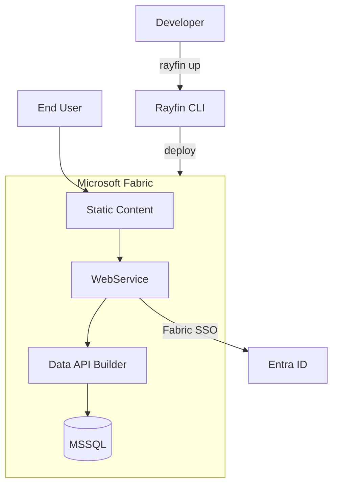

# Overview

Rayfin is a backend platform for TypeScript developers who want to model data once and receive production ready APIs, clients, and infrastructure.
It combines decorator driven schema generation, a batteries included CLI, and backend services you can run locally or in production.

> **TypeScript only** — Rayfin currently supports TypeScript as the only language for data models, client code, and application logic.

## Who is a Rayfin Builder?

A **Rayfin Builder** is an application developer who uses the Rayfin SDK to build modern TypeScript SaaS applications.
As a builder, you focus on creating great user experiences while Rayfin handles the backend infrastructure.

### Rayfin Platform vs Rayfin Applications

- **Rayfin Platform**: A modern Backend-as-a-Service (BaaS) platform built for the agentic era that provides ready-to-use backend infrastructure
- **Rayfin App/Project**: Applications built using the Rayfin SDK, leveraging the platform's capabilities
- **Rayfin Builder**: App developers (you!) who build applications using Rayfin
- **Rayfin Contributor**: Platform developers who work on Rayfin itself (see [contributor docs](https://github.com/microsoft/project-rayfin?tab=contributing-ov-file))

## How to run Rayfin

Rayfin is available in two modes.
Choose the one that fits your stage and requirements.

| | **Rayfin Local** | **Fabric Data App in Fabric** |
| --- | --- | --- |
| **What it is** | Open-source, self-hostable backend stack | Managed service for Rayfin on Microsoft Fabric |
| **Authentication** | Entra ID, Email password | Fabric SSO (Entra ID single sign-on only) |
| **Database** | MSSQL, PostgreSQL | MSSQL only |
| **Data models & APIs** | ✅ | ✅ |
| **Type-safe clients** | ✅ | ✅ |
| **Static hosting** | ✅ | ✅ |
| **CLI tooling** | ✅ | ✅ |
| **Infrastructure** | You host (Docker, VMs, or any cloud) | Fabric manages hosting, scaling, and networking |

Both modes share the same SDK, CLI, and data-modeling workflow.
Start locally, then deploy to Fabric when you need a managed service — or stay self-hosted.

## What Rayfin Provides

- **Data models to APIs**: Decorate TypeScript classes and Rayfin generates database schemas plus REST and GraphQL endpoints automatically.
- **Type safe clients**: Type-safe clients provide validation of queries and mutations before they ever hit the backend.
- **Infrastructure automation**: Use Rayfin CLI tooling to spin up Rayfin stack provisions Data API Builder, authentication, database, and more so you can focus on product code.
- **Opinionated security**: Permissions, row level filters, and per entity auth rules are configured next to your models.

## Fabric Data App (Managed Service) Architecture

When you deploy with `rayfin up`, the CLI packages your project and provisions it as a Fabric data app.
Fabric manages hosting, networking, and scaling.
Authentication uses Fabric SSO (Entra ID single sign-on) exclusively — no other auth providers are available after deployment.

Learn more about [Fabric Data App in Fabric](./app-backend/index.md) including child services, deployment, and management.

## Key Components

### Rayfin CLI

The CLI installs via `npm create @microsoft/rayfin@latest`.
It can scaffold new projects, launch local infrastructure, sync schema changes, and bundle templates for distribution

### TypeScript SDKs

- `@microsoft/rayfin-core` hosts the decorator runtime and metadata analysis helpers.
- `@microsoft/rayfin-client` wires auth, data into a single facade for apps.
- `@microsoft/rayfin-data` exposes GraphQL fluent (`client.data.gql`) APIs.

## Next Steps

- Follow the [Quick Start Guide](./getting-started/index.md) to spin up your first Rayfin project in minutes.
- Dive into [Data Models & Decorators](./data/overview.md) to understand how entities map to DAB.
- Learn how to connect frontends with the [GraphQL guide](./data/graphql.md).
- Configure authentication with [Rayfin Auth](./auth/overview.md).
- Deploy frontends with [Static Content Hosting](./hosting/index.md).
- Explore CLI capabilities in [CLI Guide](./cli/index.md).
- Learn how to manage [Deprecation Warnings](./deprecations.md).
- Review [Known Limitations](./known-limitations.md) for current behaviors and workarounds.
